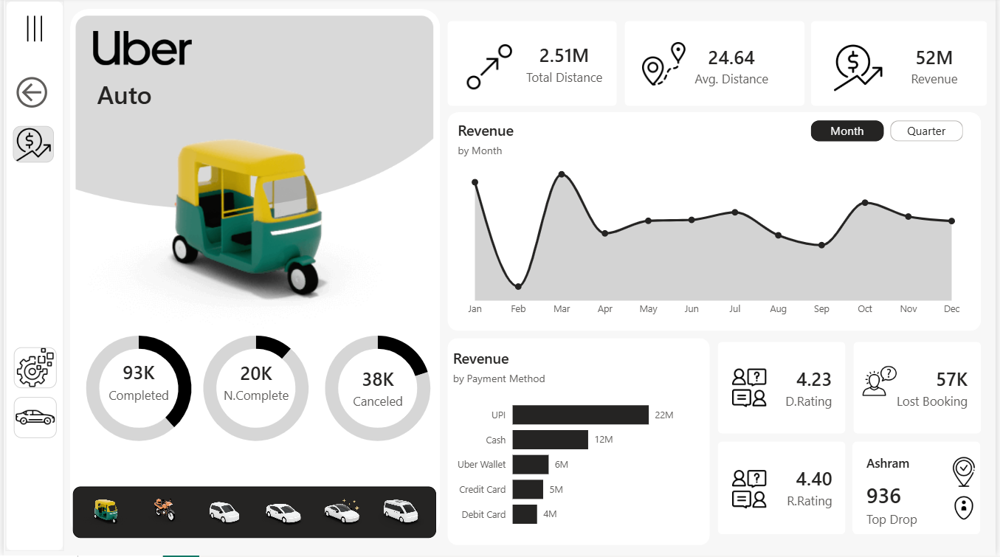

🚀 Moving Beyond Pretty Dashboards: Driving Business Impact for Uber Operations!

As a Data Analyst, my goal is never just to build a visually appealing dashboard; it’s about uncovering the stories hidden within raw numbers to drive strategic business decisions. 📊✨

I recently wrapped up a comprehensive Power BI dashboard analyzing Uber’s marketplace health, focusing heavily on operational bottlenecks, revenue leaks, and supply-demand optimization. 

Here are the key Executive Insights extracted from the "Uber Auto" segment:

🔍 1. Plugging the Revenue Leakage
While Completed Bookings reached a solid 93K, a deeper look reveals 38K canceled rides and 20K incomplete trips. This indicates a ~38% potential revenue leakage. Investigating cancellation drivers (e.g., driver rejection rates, excessive wait times) is critical to capturing this lost market share.

📉 2. Seasonality & Demand Surges
The data highlights a sharp revenue drop in February, followed by a massive, exponential spike in March and a secondary surge in October. Recommendation: Uber can optimize driver supply and implement targeted marketing promos during low-demand months while maximizing surge pricing during peak windows.

📍 3. High-Value Demand Zones
"Ashram Station" emerged as the absolute top drop-off location with 936 bookings. To maximize fleet efficiency and cut down passenger pickup times, drivers should be dynamically incentivized to position themselves near this high-traffic hub.

⭐ 4. Fleet Quality & Driver Satisfaction
There is a noticeable disparity between Rider Ratings (4.40) and Driver Ratings (4.23). In Uber's ecosystem, a 4.23 driver average is a red flag that directly correlates with the high cancellation rate. Introducing driver behavioral training and stricter vehicle audits will significantly elevate service quality and retention.

🛠️ Built with: Power BI, DAX, advanced data modeling, and tailored UI/UX principles for corporate-level decision-making.
